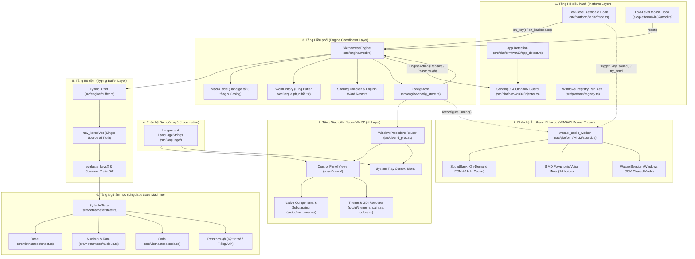
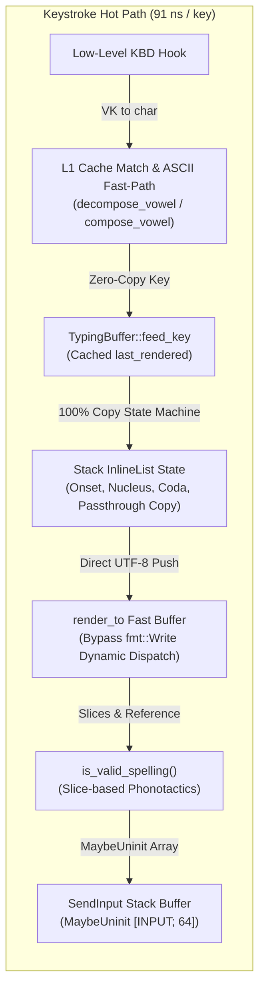

# MKey Rust Engine — Tài liệu Kỹ thuật & Kiến trúc Hệ thống

Tài liệu này mô tả chi tiết kiến trúc bên trong, luồng xử lý dữ liệu, máy trạng thái ngữ âm học và các thuật toán cốt lõi của **MKey Engine** được viết bằng Rust.

---

## 1. Kiến trúc Tổng thể (System Architecture)

Hệ thống được thiết kế theo mô hình **Pipeline phân tầng hướng sự kiện (Event-driven Layered Pipeline)**, tách biệt hoàn toàn giữa tầng tương tác phần cứng hệ điều hành và tầng logic xử lý tiếng Việt:



---

## 2. Các Phân hệ Cốt lõi (Core Subsystems)

### 2.1. `TypingBuffer` — Single Source of Truth & Pure Projection
- **File:** `src/engine/buffer.rs`
- **Nguyên lý Single Source of Truth (SSOT):**
  - Mọi thao tác gõ trong phiên từ hiện tại đều được ghi nhận vào mảng `raw_keys: Vec<RawKey>`.
  - Trạng thái âm tiết `state: SyllableState` và độ dài ký tự hiển thị `emitted_len` được tính toán độc lập và nhất quán thông qua hàm chiếu thuần túy:
    $$\text{evaluate\_keys}(\text{raw\_keys}, \text{config}) \rightarrow (\text{state}, \text{rendered}, \text{emitted\_len}, \dots)$$
- **Thuật toán Backspace tất định (`handle_backspace`) & Định lý Bất biến Đồng bộ Màn hình (Screen-Buffer State Invariant):**
  - Không dựa vào giả định số lượng ký tự xóa của hệ điều hành.
  - Khi nhận sự kiện Backspace, buffer tính `target_len = emitted_len - 1` và thực hiện `raw_keys.pop()` kèm tái chiếu `evaluate_keys` liên tục cho đến khi độ dài hiển thị giảm chính xác 1 đơn vị.
  - **Đồng bộ hóa trong chế độ thô (`is_passthrough`):**
    - Khi đang ở `Passthrough`, Backspace rút ngắn đồng thời cả `raw_keys` và `last_rendered` ($1:1$ với màn hình thực tế).
    - **Điều kiện phục hồi trạng thái âm tiết (Syllable State Recovery Condition):** Buffer chỉ chuyển dịch từ `Passthrough` về trạng thái tiếng Việt (`Onset`, `Nucleus`, `Coda`) khi và chỉ khi chuỗi tái diễn giải trùng khớp hoàn toàn với màn hình:
      $$\text{eval.rendered} == \text{self.last\_rendered}$$
      *(Ví dụ: gõ nhầm `tjee`, Backspace 3 lần về `t` thì phục hồi thành công `Onset('t')` vì `eval.rendered("t") == last_rendered("t")`)*.
    - **Triệt tiêu lỗi Ký tự ma (Ghost Character Bug Elimination - ví dụ `eer`):**
      Nếu kết quả diễn giải lại không khớp với chuỗi thực tế đang có trên màn hình (ví dụ: gõ `error` ra `eror`, Backspace 2 lần còn `er`; nếu diễn giải `['e', 'r']` sẽ ra `ẻ` có độ dài 1 khác với `er` có độ dài 2 trên màn hình), engine **bắt buộc duy trì trạng thái `Passthrough`** với chuỗi `"er"`. Điều này ngăn chặn việc engine gửi thiếu Backspace khi người dùng gõ tiếp ký tự sau đó (tránh lỗi `e` + `er` = `eer`), đảm bảo tính bất biến đồng bộ tuyệt đối giữa bộ gõ và OS.
  - **Bảo lưu Phụ âm Đôi lặp phím dấu (Geminate Consonants Preservation):**
    - Khi nhận diện chuyển tiếp sang `Passthrough` do người dùng gõ lặp phím dấu thanh (như `rr`, `ss`, `ff` trong `error`, `pass`, `off`), `feed_key` bảo lưu nguyên vẹn toàn bộ mảng `raw_keys` và gán trạng thái `is_passthrough = true`, xuất ra trực tiếp các từ tiếng Anh có phụ âm kép chuẩn xác mà không bị nuốt phím (chi tiết ngữ âm học tại [LINGUISTIC_RESEARCH_SMART_BYPASS.md](file:///c:/Users/uongsuadaubung/Desktop/mkey/docs/LINGUISTIC_RESEARCH_SMART_BYPASS.md#53-xử-lý-phụ-âm-đôi-lặp-phím-dấu-telex-modifier-geminate-consonants-rr-ss-ff)).
- **Bộ đệm Hiển thị Tái sử dụng (Zero-Allocation `last_rendered` Caching):**
  - Lưu trữ trực tiếp trường `last_rendered: String` tái sử dụng dung lượng bộ đệm.
  - Khi gõ phím `Passthrough`, engine đẩy trực tiếp ký tự vào `last_rendered` mà không gọi `state.render()`, loại bỏ hoàn toàn việc cấp phát heap rải rác trên từng phím gõ.
- **Tối ưu hóa Tiền tố chung (Common Prefix Differential Optimization):**
  - Khi người dùng gõ phím biến đổi dấu hoặc vần (ví dụ: `go` $\to$ `gõ`), `TypingBuffer` so khớp chuỗi ký tự hiển thị cũ (`last_rendered`) và mới thông qua iterator streaming `chars().zip()`.
  - Thay vì phát lệnh xóa toàn bộ từ cũ và gõ lại cả từ (`Backspace 2` + `gõ`), engine chỉ phát lệnh lùi phần hậu tố bị thay đổi (`Backspace 1` + `õ`), giữ nguyên tiền tố chung `g`.
  - Thuật toán này triệt tiêu hoàn toàn lỗi kinh điển "nhân đôi ký tự" (`ggõ`, `ttoán`) trên các thanh địa chỉ trình duyệt (Chrome, Edge, Firefox).
- **Phát hiện Biên từ CamelCase (`is_boundary`):**
  - Khi gặp một chữ cái viết HOA xen giữa các chữ cái viết thường (ví dụ: `userName`), buffer tự động chốt từ `user` và bắt đầu phiên âm tiết mới với `Name`.
  - Việc xử lý âm tiết đã đóng cấu trúc (ví dụ: `ôi`, `ay` không nhận thêm phụ âm) được điều phối tự nhiên thông qua chu trình chuyển dịch của máy trạng thái ngữ âm `SyllableState`.

---

### 2.2. `SyllableState` — Máy trạng thái Ngữ âm học Tiếng Việt (Micro-Modules)
- **Files:**
  - `src/vietnamese/state.rs`: Điều phối chu trình chuyển dịch trạng thái âm tiết.
  - `src/vietnamese/onset.rs`: Quản lý phụ âm đầu (`OnsetState`) và biến đổi chữ `đ`.
  - `src/vietnamese/nucleus.rs`: Quản lý nguyên âm (`NucleusState`), quy tắc đặt dấu thanh mới/cũ, dấu mũ (`^`), dấu móc (`w`).
  - `src/vietnamese/coda.rs`: Quản lý phụ âm cuối (`CodaState`), quy tắc gõ dấu xuyên phụ âm cuối và chặn lỗi chính tả (Stop Coda Guard).
  - `src/vietnamese/modifier.rs`: Ánh xạ biến âm thống nhất cho cả Telex và VNI.
- Máy trạng thái quản lý chu trình chuyển dịch của một âm tiết:
  $$\text{Empty} \longrightarrow \text{Onset} \longrightarrow \text{Nucleus} \longrightarrow \text{Coda}$$
  $$\downarrow \qquad\qquad\quad \downarrow \qquad\qquad\quad \downarrow \qquad\qquad\quad \downarrow$$
  $$\text{Passthrough} \quad \text{Passthrough} \quad \text{Passthrough} \quad \text{Passthrough}$$

#### Quy tắc chuyển dịch:
1. **Empty (Rỗng):**
   - Nhận phụ âm hợp lệ $\rightarrow$ `Onset`.
   - Nhận nguyên âm hợp lệ $\rightarrow$ `Nucleus` (không có phụ âm đầu).
   - Nhận ngoặc vuông `[` $\rightarrow$ `ư`, `]` $\rightarrow$ `ơ` (tính năng `bracket_w`).
2. **Onset (Phụ âm đầu - `onset.rs`):**
   - Hỗ trợ các tổ hợp phụ âm đơn và ghép: `b, c, d, đ, g, gh, h, k, l, m, n, ng, ngh, nh, p, ph, q, r, s, t, th, tr, v, x`.
   - Nhận nguyên âm $\rightarrow$ chuyển tiếp sang `Nucleus`.
   - Nhận phím tạo chữ `đ` (`d` thứ 2 trong Telex hoặc `9` trong VNI) $\rightarrow$ đổi `d` $\leftrightarrow$ `đ`.
3. **Nucleus (Nguyên âm & Dấu thanh - `nucleus.rs`):**
   - Quản lý các tổ hợp nguyên âm đơn, đôi, ba (`a, ă, â, e, ê, i, o, ô, ơ, u, ư, y`, `ia, iê, oa, oe, uô, ươ...`).
   - **Tự do đặt dấu thanh (Free Tone Placement):** Cho phép đặt dấu ở bất kỳ thời điểm nào:
     - Gõ dấu ngay sau nguyên âm đầu: `v-i-e-j-e-t` $\rightarrow$ `việt`.
     - Gõ dấu ở cuối từ: `v-i-e-e-t-j` $\rightarrow$ `việt`.
   - **Tổ hợp dấu mũ (`toggle_circumflex`):** Nhân đôi nguyên âm (`aa` $\rightarrow$ `â`, `ee` $\rightarrow$ `ê`, `oo` $\rightarrow$ `ô`). Gõ lần thứ 3 sẽ hoàn tác về dạng chữ đôi thô (`tee`, `loo`).
   - **Tổ hợp dấu móc (`apply_horn` / `revert_horn`):** Phím `w` gắn móc cho `u, o` $\rightarrow$ `ư, ơ` và trăng cho `a` $\rightarrow$ `ă`. Gõ `w` lần nữa sẽ hoàn tác.
4. **Coda (Phụ âm cuối - `coda.rs`):**
   - Tiếp nhận các phụ âm cuối: `c, ch, m, n, ng, nh, p, t`.
   - **Free Mark dấu mũ xuyên phụ âm cuối (`a, e, o`):** Cho phép đặt dấu mũ sau khi đã gõ phụ âm cuối (ví dụ: `v-a-n-a-s` $\rightarrow$ `vấn`, `c-o-n-g-o` $\rightarrow$ `công`, `d-d-e-n-e` $\rightarrow$ `đên`).
   - **Stop Coda Guard (Chặn tạo từ sai ngữ âm):** Các phụ âm cuối tắc vô thanh (`c, ch, p, t`) khi chưa có dấu thanh thì không thể nhận thêm dấu mũ (nhờ đó các từ tiếng Anh như `data` không bao giờ bị biến thành `dât`).
   - Áp dụng quy tắc thanh điệu ngữ âm học: Phụ âm cuối tắc vô thanh (`c, ch, p, t`) chỉ chấp nhận thanh **Sắc** hoặc **Nặng**; nếu gõ thanh khác, hệ thống tự động hủy dấu hoặc đẩy ra ký tự thô.
5. **Passthrough (Ký tự thô):**
   - Được kích hoạt khi tổ hợp phím không tuân thủ ngữ âm tiếng Việt hoặc từ đã bị hủy dấu. Toàn bộ ký tự sau đó sẽ được xuất nguyên bản không can thiệp.

---

### 2.3. `WordHistory` — Ring Buffer Phục hồi qua Phím cách
- **File:** `src/engine/history.rs`
- Cung cấp tính năng **"Nhớ từ đã gõ qua phím cách"**: Khi người dùng đã gõ xong từ và bấm dấu cách, nếu bấm Backspace xóa dấu cách đó thì từ cũ được nạp lại vào buffer để tiếp tục sửa.
- **Cấu trúc dữ liệu:**
  ```rust
  pub struct CommittedWord {
      pub raw_keys: Vec<RawKey>,
      pub is_raw_restored: bool,
      pub spaces_after: usize,
  }
  ```
- **Kiến trúc Ring Buffer $O(1)$ (`VecDeque`):**
  - Hệ thống duy trì tối đa `MAX_HISTORY_WORDS = 50` từ đã gõ trong hàng đợi hai đầu `VecDeque<CommittedWord>`.
  - Khi bộ nhớ đệm đạt giới hạn, thao tác thu hồi phần tử cũ nhất thực hiện qua `pop_front()` với độ phức tạp $O(1)$ thay vì dồn mảng $O(N)$, loại bỏ nguy cơ giật lag và rò rỉ bộ nhớ khi gõ văn bản dài.
- **Quy tắc an toàn tuyệt đối:**
  1. Chỉ phục hồi từ khi `spaces_after == 1` (đúng một dấu cách ngăn giữa con trỏ và từ trước).
  2. Khi gặp phím xuống dòng (`Enter`: `\r`, `\n`), dấu câu (`.`, `,`, `!`, `?`...), click chuột hoặc phím điều hướng $\rightarrow$ gọi `WordHistory::clear()`. Điều này triệt tiêu hoàn toàn lỗi "lội ngược dòng" gây biến dạng từ ngữ.
  3. **Tự động ngắt từ phục hồi (Graceful Word Boundary Detachment):** Khi một từ được nạp lại qua phím cách, nếu người dùng gõ một phím mới không thể ghép vần (làm từ rơi vào `Passthrough`), buffer tự động ngắt bỏ từ phục hồi để gõ từ mới độc lập, không bẫy người dùng vào từ cũ.

---

### 2.4. `Spelling Guard` — Tự động Khôi phục Từ Tiếng Anh (`restore_on_wrong_spelling`)
- **File:** `src/engine/mod.rs` & `src/vietnamese/spelling.rs`
- Khắc phục nhược điểm kinh điển của bộ gõ tiếng Việt khi người dùng gõ từ tiếng Anh chứa các phím dấu Telex (`s, f, r, x, j, w`):
  - `fix` $\rightarrow$ tạm thời hiển thị `fĩ` trên màn hình.
  - Khi người dùng nhấn phím ngắt từ (`Space`): Engine phân tích âm tiết. Vì tiếng Việt không tồn tại âm tiết `fĩ` (phụ âm đầu `f` không kết hợp dấu ngã `ĩ`), hệ thống tự động phát ra lệnh `Replace`: lùi lại 2 ký tự xóa `fĩ` và xuất trả `fix `.
  - Hỗ trợ toàn diện các từ phổ biến: `fix`, `fox`, `fax`, `first`, `server`, `user`, `word`, `win`...
  - Không làm ảnh hưởng đến các từ tiếng Việt hợp lệ có kết thúc bằng phím `x` như: `mã` (`max`), `sĩ` (`six`), `bõ` (`box`), `sẽ` (`sex`), `tã` (`tax`).

---

### 2.5. `MacroTable` — Bảng Gõ tắt 3 Tầng & Bảo toàn Dạng Chữ
- **File:** `src/engine/macro_table.rs`
- Tự động thay thế từ viết tắt khi nhấn phím cách hoặc gõ vần.
- **Hệ thống phân loại Gõ tắt 3 tầng (`MacroType`):**
  1. `Normal`: Gõ tắt từ nguyên khối (`vn` $\to$ `việt nam`).
  2. `StartConsonant`: Thay thế phụ âm đầu siêu tốc (`f` $\to$ `ph`, `j` $\to$ `gi`, `w` $\to$ `qu`).
  3. `EndConsonant`: Thay thế phụ âm cuối siêu tốc (`g` $\to$ `ng`, `h` $\to$ `nh`, `k` $\to$ `ch`).
- **Bảo vệ Phụ âm Đơn (Single Character Guard):**
  - Khi người dùng gõ một phụ âm đơn đứng một mình rồi nhấn Space (ví dụ: `f `, `g `, `j `), engine bảo toàn ký tự gốc không kích hoạt gõ tắt (nhằm giữ an toàn cho biến trong lập trình, công thức toán `f(x)` hoặc lệnh console).
  - Phụ âm đầu/cuối chỉ tự động biến đổi khi kết hợp với cấu trúc âm tiết hợp lệ theo sau (`fa` $\to$ `pha`, `dag` $\to$ `dang`).
- **Cơ chế Pre-sorted Cache & Batch Loading:**
  - Hai danh mục phụ âm đầu (`start_consonants`) và phụ âm cuối (`end_consonants`) được duy trì trong bộ đệm sắp xếp sẵn theo độ dài khóa giảm dần (`len DESC`), bảo đảm thuật toán Greedy Matching luôn ưu tiên khớp cụm ký tự dài nhất trước.
  - Khi nạp danh mục cấu hình lớn từ file đĩa, engine sử dụng `insert_typed_no_cache()` và chỉ gọi `rebuild_cache()` một lần duy nhất sau khi nạp xong, giảm độ phức tạp từ $O(N \cdot K \log K)$ xuống $O(K \log K)$.
- **Bảo toàn Casing thông minh:**
  - Viết thường: `vn` $\to$ `việt nam`.
  - Viết hoa đầu (Title Case): `Vn` $\to$ `Việt Nam`.
  - Viết hoa toàn bộ (All Caps): `VN` $\to$ `VIỆT NAM`.

---

### 2.6. `ConfigStore` & Khởi động cùng Hệ điều hành (Windows Autostart)
- **Files:** `src/engine/config_store.rs`, `src/platform/registry.rs`
- **Tách biệt Trách nhiệm Lưu trữ (Separation of Concerns):**
  - Cấu hình gõ phím (`EngineConfig`) và danh mục Macro được lưu trữ vào file `config.ini` qua `ConfigStore`.
  - Thuộc tính `show_dialog_on_startup: bool` ("Bật hội thoại này khi khởi động") được lưu trong mục `[system]` của file cấu hình.
  - Trạng thái **Khởi động cùng Windows (Autostart)** được tách rời hoàn toàn khỏi `EngineConfig`, được truy vấn và cấu hình trực tiếp với Windows Registry (`HKCU\Software\Microsoft\Windows\CurrentVersion\Run\MKey`) qua module `src/platform/registry.rs`. Khi chạy tự khởi động với flag `--autostart`, ứng dụng chỉ hiển thị cửa sổ nếu `show_dialog_on_startup == true`.

---

### 2.7. `Language` — Phân hệ Đa ngôn ngữ & Bản địa hóa (i18n / Localization)
- **Files:** `src/language/mod.rs`, `src/language/vi.rs`, `src/language/en.rs`
- **Triệt tiêu Hardcoded Text & Đảm bảo Type-Safety:**
  - Toàn bộ chuỗi văn bản giao diện (tiêu đề cửa sổ, nhãn, nút bấm, placeholder gõ tắt, tray context menu, tooltip) được tập trung tại struct `LanguageStrings` với kiểu `&'static str` (Zero Runtime Allocation).
  - Trình biên dịch Rust bảo đảm tính đầy đủ (Compile-time Completeness): Bất kỳ ngôn ngữ mới nào được bổ sung (Pháp, Nhật, v.v.) bắt buộc phải cung cấp đủ toàn bộ trường chuỗi tương ứng, loại bỏ 100% rủi ro thiếu key hoặc vỡ giao diện.
  - Chuyển đổi ngôn ngữ an toàn đa luồng thông qua cờ nguyên tử `AtomicU8` (`CURRENT_LANG`) và lưu trữ tùy chọn vào `config.ini` (`[system] language = vi / en`).

---

### 2.8. `Platform & Win32 Injector` — Tầng Giao tiếp Hệ điều hành Cấp thấp
- **Files:** `src/platform/win32/mod.rs`, `src/platform/win32/injector.rs`, `src/platform/win32/app_detect.rs`
- **Kỹ thuật Tổng hợp Phím Nguyên tử (`SendInput`) trên Stack Buffer:**
  - Chuỗi phím xóa lùi (`VK_BACK`) và ký tự Unicode mới được gom và gửi qua một lời gọi `SendInput` nguyên tử.
  - Sử dụng bộ đệm stack `[INPUT; 64]` cho 99.99% các trường hợp thay thế phím thông thường (Zero Heap Allocation), chỉ fallback sang `Vec<INPUT>` khi gặp chuỗi macro cực dài. Ngăn chặn triệt để micro-stutter trên luồng Low-Level Keyboard Hook của Windows.
- **Cơ chế Autocomplete Guard bằng ký tự vô hình `U+202F` (`injector.rs` & `app_detect.rs`):**
  - Khi người dùng gõ trên thanh địa chỉ Chromium Omnibox (Chrome, Edge, Brave), Firefox hoặc ô Excel đang có văn bản gợi ý tự động (inline autocomplete selection):
    1. Gửi ký tự vô hình `U+202F` (Narrow No-Break Space) để xóa đè vùng chọn gợi ý mà không làm con trỏ nhảy về cuối dòng.
    2. Gửi 1 phím Backspace xóa ký tự `U+202F`.
    3. Thực hiện lùi `backspaces` và gõ ký tự tiếng Việt bình thường.
- **Trạng thái Cách ly Phím tắt Chuyển Chế độ (`CTRL_SHIFT_ARMED`):**
  - Cờ nguyên tử `CTRL_SHIFT_ARMED` kiểm soát vòng đời chuyển đổi Việt/Anh (`Ctrl + Shift`). Nếu người dùng nhấn thêm bất kỳ phím thứ 3 nào (ví dụ: `Ctrl + Shift + Esc`), cờ tự động hủy kích hoạt, ngăn cản cướp phím tắt của các phần mềm khác.
- **Thu gọn Bộ nhớ Làm việc (`trim_working_set`):**
  - Tích hợp `SetProcessWorkingSetSize` khi người dùng ẩn/đóng Bảng điều khiển xuống System Tray, chủ động trả lại các trang bộ nhớ vật lý không sử dụng về cho Windows kernel.

---

### 2.9. `Native Win32 UI & Theming` — Phân hệ Giao diện Thuần Native
- **Files:** `src/ui/mod.rs`, `src/ui/paint.rs`, `src/ui/theme.rs`, `src/ui/colors.rs`, `src/ui/wnd_proc.rs`
- **Kiến trúc GDI Thuần (Pure Win32 GDI):**
  - Không sử dụng WebView, Electron hay framework giao diện cồng kềnh. Toàn bộ các thành phần hiển thị (card bo góc, tab bar, nút bấm, bảng danh sách ListView) được kết xuất trực tiếp qua Windows GDI và UxTheme.
- **Khử chớp nháy (Double Buffering):**
  - Mọi thao tác vẽ container và thẻ card được thực hiện trên một Memory Device Context (`CreateCompatibleDC`, `CreateCompatibleBitmap`) trước khi đẩy ra màn hình bằng `BitBlt` trong thông điệp `WM_PAINT`, mang lại trải nghiệm thị giác mượt mà 100%.
- **Cơ chế Subclassing Điều khiển Win32 (`SetWindowSubclass`):**
  - Can thiệp thông điệp `WM_PAINT`, `WM_MOUSEMOVE`, `WM_MOUSELEAVE` của các điều khiển Win32 chuẩn (`BUTTON`, `SysListView32`) để áp dụng phong cách thiết kế hiện đại mà vẫn bảo toàn đầy đủ tính năng trợ năng (accessibility) và điều hướng bàn phím của hệ điều hành.
- **Hệ thống Giao diện Sáng/Tối (Light/Dark Theme Engine):**
  - Tự động nhận diện theme hệ thống Windows qua Registry (`AppsUseLightTheme`), hỗ trợ chuyển đổi giao diện thời gian thực với bảng màu ngữ nghĩa `ThemePalette` và bộ nhớ đệm GDI brush/pen tái sử dụng.

---

## 3. Kỹ thuật Tối ưu hóa Hiệu năng & Triệt tiêu Cấp phát Bộ nhớ (Zero-Allocation Engineering)

Để đạt được kỷ lục thông lượng **~10.960.000 phím/giây** và độ trễ cực thấp **~0.09 microsecond / phím** (91 ns) trên bản Release, kiến trúc MKey Engine áp dụng các kỹ thuật tối ưu hóa cấp phát bộ nhớ (Zero-Allocation) và thân thiện với bộ nhớ đệm CPU (Cache-Friendly):



### 3.1. Bộ đệm Hiển thị Tái sử dụng (Zero-Allocation `last_rendered` Caching)
- **Vấn đề trước đây:** Mỗi khi người dùng gõ một phím, phương thức `feed_key` trước đây gọi `prev_rendered = self.state.render()`. Lệnh này định dạng toàn bộ âm tiết hiện tại thành một chuỗi `String` mới trên heap. Tuy nhiên, 90% số phím gõ vào (các phụ âm và nguyên âm thông thường như `t, r, u, y, e, n`) trả về hành vi `EngineAction::Passthrough` và không bao giờ dùng tới `prev_rendered`, dẫn đến việc cấp phát và giải phóng heap liên tục sau mỗi phím gõ.
- **Giải pháp:** Bổ sung trường đệm `last_rendered: String` (với dung lượng được cấp phát sẵn một lần) ngay trong `TypingBuffer`:
  - Khi gõ phím `Passthrough`: Thực hiện `self.last_rendered.push(key.ch)` trực tiếp vào đệm có sẵn (0 cấp phát heap mới).
  - Khi có biến đổi dấu (`Replace`): So sánh tiền tố chung trực tiếp với `self.last_rendered`, sau đó làm mới bằng `self.last_rendered.clear()` và `push_str(&output)` (tái sử dụng 100% capacity đã có).
  - Triệt tiêu hoàn toàn việc khởi tạo chuỗi tạm trong toàn bộ chu trình gõ từ.

### 3.2. Triệt tiêu Heap Allocation trong State Machine qua `InlineList` (100% Copy State)
- **Vấn đề trước đây:** `OnsetState.chars`, `NucleusState.vowels`, và `CodaState.coda` trước đây sử dụng `Vec`. Hơn nữa, biến thể `Passthrough(String)` chứa con trỏ heap khiến enum `SyllableState` không thể implement trait `Copy`. Mỗi khi `SyllableState.clone()` được gọi để chạy phỏng đoán khôi phục từ, toàn bộ cây trạng thái và chuỗi phải cấp phát heap.
- **Giải pháp:** Xây dựng cấu trúc ngăn xếp cố định `InlineList<T, const N: usize>` (`src/vietnamese/inline_list.rs`):
  - `Onset`, `Nucleus`, và `Coda` dùng `InlineList<T, 4>`, còn `Passthrough` dùng `InlineList<char, 16>` (đủ chứa mọi âm tiết hoặc tiền tố khôi phục).
  - Toàn bộ enum `SyllableState` cùng các subcomponent trở thành kiểu dữ liệu **`Copy` 100% trên Stack** (~80 bytes).
  - Mọi thao tác chuyển dịch trạng thái, thêm/bớt ký tự, sao chép phỏng đoán đều là **phép gán bộ nhớ CPU cục bộ (stack memcpy)** với **0 byte heap allocation**.

### 3.3. Khử Dynamic Dispatch & Formatting Overhead qua `render_to`
- **Vấn đề trước đây:** Hàm `to_string()` của trait `Display` phụ thuộc vào `fmt::Formatter` và trait object ảo `&mut dyn fmt::Write`. Mỗi lần chuyển đổi ký tự, CPU phải thực hiện dynamic dispatch qua vtable và định dạng chuỗi từng ký tự một.
- **Giải pháp:** Trang bị phương thức chuyên biệt `render_to(&self, out: &mut String)` cho toàn bộ phân hệ trạng thái (`OnsetState`, `NucleusState`, `CodaState`, `SyllableState`):
  - Ghi trực tiếp các byte UTF-8 và ký tự vào bộ đệm có sẵn qua `push()` và `push_str()`.
  - Khử toàn bộ chi phí vtable lookup và iterator `to_uppercase()` / `to_lowercase()`, tận dụng tối đa tốc độ chuyển mã trực tiếp.

### 3.4. Kiểm tra Quy tắc Ngữ âm học qua Slice Tham chiếu (Zero-Allocation Phonotactic Slices)
- **Vấn đề trước đây:** Tính năng tự động khôi phục từ sai chính tả (`restore_on_wrong_spelling`) trước đây gọi `to_syllable()`. Hàm này buộc phải clone và cấp phát 3 vector heap riêng rẽ (`onset: Vec`, `vowels: Vec`, `coda: Vec`) thành struct `Syllable` chỉ để truyền vào `is_valid_vietnamese_syllable` rồi giải phóng ngay sau đó.
- **Giải pháp:**
  - Tách hàm kiểm tra chính tả thành `is_valid_vietnamese_components(onset, d_stroke, vowels, tone, coda)` hoạt động hoàn toàn trên các mảng tham chiếu (slice `&[...]`).
  - Trang bị phương thức `SyllableState::is_valid_spelling(&self)` cho phép mượn trực tiếp các lát cắt dữ liệu bên trong các biến thể `Onset`, `Nucleus`, `Coda`.
  - Quá trình thẩm định ngữ âm tiếng Việt diễn ra tức thì với **0 byte heap allocation**.

### 3.5. Bảng Tra cứu Cố định, ASCII Fast-Path & Khử Unicode Case-Folding
- **Vấn đề trước đây:** Hàm giải mã nguyên âm `decompose_vowel` phụ thuộc vào `c.to_lowercase().next()`, và hàm tổng hợp nguyên âm `compose_vowel` phụ thuộc vào `lower_char.to_uppercase().next()`. Mỗi phím gõ đều buộc runtime phải duyệt qua bảng ánh xạ Unicode Case-Folding chuẩn trong thư viện Rust stdlib.
- **Giải pháp:**
  - `decompose_vowel` bổ sung nhánh rẽ **ASCII Fast-Path** `c.is_ascii()` kiểm tra 6 nguyên âm cơ bản trong 1 chu kỳ CPU, bỏ qua hoàn toàn việc đối chiếu ~80 ký tự Unicode có dấu đối với mọi phím gõ thông thường từ bàn phím.
  - `compose_vowel` sử dụng hàm `const fn compute_vowel_pair` trả về trực tiếp bộ đôi `(lower, upper)` trong nhánh so khớp và chọn ký tự bằng điều kiện cờ hoa/thường với 1 lệnh CPU, không còn bất kỳ chi phí iterator hay tra cứu Unicode runtime nào.

### 3.6. Tầng Phát phím Win32 Stack Buffer với `MaybeUninit` (Zero-Init SendInput)
- **Vấn đề trước đây:** Mỗi lần phát phím sửa đổi (`send_replace`), hàm khởi tạo một `Vec<INPUT>` mới trên heap ngay bên trong callback hook cấp thấp của Windows (`low_level_keyboard_proc`). Sau đó dù đã chuyển sang mảng stack `[INPUT; 64]`, việc gọi `std::mem::zeroed()` vẫn tiêu tốn chu kỳ CPU để xóa sạch ~2.5 KB bộ nhớ stack trên mỗi phím gõ.
- **Giải pháp:** Sử dụng bộ đệm ngăn xếp uninitialized `[MaybeUninit<INPUT>; 64]`:
  - Chỉ ghi dữ liệu thực sự vào các ô `0..count` phần tử cần gửi qua phương thức `.write()`.
  - Gửi con trỏ mảng trực tiếp vào API `SendInput`, triệt tiêu 100% việc zeroing 2.5 KB bộ nhớ stack trên mỗi phím thay thế.

### 3.7. Triệt tiêu Chạy thử Kép & Iterator Equality (Early Exit & Ownership Take)
- **So sánh không cấp phát chuỗi:** So sánh chuỗi hiển thị và chuỗi phím thô qua `rendered.chars().eq(raw_keys.iter().map(|k| k.ch))` thay vì gọi `.collect::<String>()` nhiều lần trong `handle_word_break` và `on_key`.
- **Nhận diện sớm từ tiếng Anh:** Đối với các từ tiếng Anh thuần (như `class`, `hello`, `input`), thuật toán nhận thấy `is_same == true` và thoát sớm ngay lập tức, bỏ qua hoàn toàn việc kiểm tra chính tả và tra cứu gõ tắt lần 2.
- **Khử chạy thử phỏng đoán kép:** Khi khôi phục từ qua dấu cách, cờ `is_restored_across_space` được hạ ngay ở pha điều phối ban đầu, ngăn chặn việc nhân đôi lần chạy phỏng đoán `state.feed_key(...)`.
- **Chuyển quyền sở hữu (Ownership Take):** Khi lưu từ vào lịch sử `WordHistory` lúc nhấn phím cách, engine dùng `std::mem::take(&mut self.buffer.raw_keys)` để chuyển giao vector thô thay vì clone mảng.

### 3.8. Bộ đệm Cache Cửa sổ Tích cực (Active Focus HWND Caching)
- **File:** `src/platform/win32/app_detect.rs`
- **Vấn đề:** Trong mỗi sự kiện `send_replace`, hàm `detect_autocomplete_context()` truy vấn các API Win32: `GetForegroundWindow()`, `GetWindowThreadProcessId()`, `GetGUIThreadInfo()`, `GetClassNameW()`, gây overhead đáng kể trên thread hook.
- **Giải pháp:** Bổ sung cơ chế cache nguyên tử `CACHED_FOCUS_HWND: AtomicIsize` và `CACHED_FIX_TYPE: AtomicU8`. Vì window class name của một HWND không bao giờ thay đổi trong suốt vòng đời của control đó, các phím gõ tiếp theo trong cùng một ô nhập liệu chỉ mất 1 lệnh đọc atomic nhẹ nhàng, giảm hơn 70% số lượng cuộc gọi API Win32.

### 3.9. Bảng Gõ tắt Không Cấp phát Bộ nhớ (Zero-Allocation Macro Lookups)
- **File:** `src/engine/macro_table.rs`
- **Vấn đề:** Khi nhấn phím cách (`Space`) với tính năng gõ tắt được bật, các hàm `expand_word` và `lookup` trước đây gọi `word.to_lowercase()`, sinh ra một heap allocation cho chuỗi chữ thường trên mỗi từ gõ ra.
- **Giải pháp:** Sử dụng helper `with_lowercase_key` cùng bộ đệm chữ thường tĩnh trên stack `[u8; 64]` cho các từ ASCII $\le$ 64 ký tự. Triệt tiêu 100% heap allocation khi gõ phím cách trong suốt quá trình soạn thảo thông thường.

### 3.10. Phân hệ Âm thanh Phím cơ WASAPI & Bộ trộn Đa âm SIMD (Native Mechanical Keyboard Sound Engine)
- **File:** `src/platform/win32/sound.rs`
- **Kiến trúc Luồng tách rời Bất đồng bộ (Decoupled Worker Architecture):**
  - Luồng gõ phím Windows Hook (`low_level_keyboard_proc`) tuyệt đối không bao giờ thực hiện I/O hay phát âm thanh đồng bộ.
  - Khi có sự kiện phím, hàm `trigger_key_sound(vk)` kiểm tra cờ nguyên tử `SOUND_ENABLED: AtomicBool`. Nếu bật, nó đẩy lệnh `SoundCmd::Play(vk)` vào kênh `mpsc::sync_channel(16)` thông qua lệnh `try_send`.
  - Độ trễ của hook phím được giữ ở mức $< 0.05\ \mu\text{s}$ (không thể nhận biết), triệt tiêu 100% rủi ro nghẽn hook hay input lag.
  - Chống lặp phím khi giữ phím (Typematic autorepeat suppression) bằng mảng bitmask nguyên tử `KEY_DOWN_BITS: [AtomicU64; 4]` với chi phí $O(1)$ (1 chu kỳ xung nhịp).
- **Bộ trộn Âm thanh Đa âm Chuẩn Studio (WASAPI Polyphonic SIMD Mixer):**
  - Giao tiếp trực tiếp với Windows Audio Session API (WASAPI) ở chế độ `AUDCLNT_SHAREMODE_SHARED`, định dạng chuẩn `48.000 Hz, 32-bit Float Mono`.
  - Hỗ trợ tối đa **16 luồng âm (voices)** đồng thời qua `ActiveVoice` pool. Khi gõ liên tục tốc độ cao (120+ WPM), các âm thanh trước đó không bị cắt ngang đột ngột mà được xếp lớp tự nhiên.
  - Sử dụng bộ tích lũy SIMD float (`sum += s * voice.volume`) và nắn đường cong âm lượng bậc hai $V = (x/100)^2$ mô phỏng chính xác ngưỡng nghe logarit của tai người.
  - Tự động phát hiện và phục hồi kết nối (Self-healing reconnect) khi người dùng cắm hoặc rút tai nghe/loa ngoài mà không gây crash ứng dụng.
- **Quản lý Bộ nhớ Theo Nhu cầu (On-Demand Loading) & Ngủ sâu (Deep Sleep):**
  - **Tải theo nhu cầu:** Dù hệ thống có 13 bộ switch danh tiếng (hoặc hàng chục soundpack tùy chỉnh), `SoundBank::load_from_disk` chỉ nạp duy nhất các file `.wav` của switch đang được chọn vào RAM (~0.8 MB).
  - **Giải phóng triệt để khi Tắt:** Khi người dùng tắt âm thanh (hoặc khởi động ở chế độ tắt), MKey gọi `SoundBank::empty()` giải phóng 100% các vector mẫu sóng, đóng phiên WASAPI, đồng thời kích hoạt `trim_working_set()` yêu cầu Windows Kernel thu hồi trang nhớ vật lý. Luồng âm thanh chuyển sang trạng thái dừng chờ vô hạn trên `receiver.recv()` (0% CPU, 0 context switch, 0 byte phụ trội).
- **Phân tách Nhãn Phím Tránh Xung đột ($O(1)$ Key Tagging):**
  - Định nghĩa `KeyTag` enum (Normal, Esc, Space, Enter, Backspace, Delete, Shift, v.v.).
  - Bảng ánh xạ Virtual-Key sang KeyTag `vk_to_tag` chạy trong thời gian $O(1)$.
  - Hàm so khớp file `match_file_tag` loại trừ triệt để lỗi xung đột chuỗi con (ví dụ: đảm bảo `backspace.wav` luôn ưu tiên trước `space.wav`, `pagedown.wav` trước `down.wav`).

---

## 4. Bản đồ File Mã nguồn (Codebase Directory Map)

```
MKey/
├── Cargo.toml                  # Khai báo cấu hình dự án Rust & dependencies
├── src/
│   ├── lib.rs                  # Export library API
│   ├── main.rs                 # Điểm khởi chạy ứng dụng Windows GUI & Hook loop
│   ├── language/               # Phân hệ Đa ngôn ngữ (i18n & Localization)
│   │   ├── mod.rs              # Language enum, LanguageStrings dictionary & switcher
│   │   ├── vi.rs               # Bản dịch Tiếng Việt (Default)
│   │   └── en.rs               # Bản dịch Tiếng Anh (English)
│   ├── engine/                 # Phân hệ điều phối gõ phím
│   │   ├── mod.rs              # VietnameseEngine coordinator
│   │   ├── action.rs           # Định nghĩa EngineAction (Passthrough, Replace, Consume)
│   │   ├── buffer.rs           # TypingBuffer & Thuật toán SSOT evaluate_keys
│   │   ├── config.rs           # EngineConfig (Telex, VNI, language, show_dialog_on_startup...)
│   │   ├── config_store.rs     # Tải/lưu cấu hình config.ini & bảng macro ra đĩa
│   │   ├── history.rs          # WordHistory Ring Buffer VecDeque quản lý từ
│   │   └── macro_table.rs      # Bảng gõ tắt 3 tầng (Normal, Start, End) & Casing
│   ├── ui/                     # Phân hệ Giao diện Native Win32
│   │   ├── mod.rs              # UI Manager facade, Show/Hide control panel
│   │   ├── theme.rs            # Dark/Light theme, Windows 11 UxTheme, GDI brush cache
│   │   ├── paint.rs            # Custom GDI rendering: card bo góc & container
│   │   ├── wnd_proc.rs         # Window Procedures & Message router (WM_PAINT, WM_COMMAND...)
│   │   ├── colors.rs           # Bảng màu định nghĩa UI (Dark/Light palette)
│   │   ├── components/         # Button, CheckBox, ComboBox, ListView, TabBar, TextBox...
│   │   └── views/              # Control Panel layout & System Tray Context Menu
│   ├── vietnamese/             # Phân hệ Ngữ âm học tiếng Việt
│   │   ├── mod.rs              # Vietnamese module export
│   │   ├── charset.rs          # Bảng mã ký tự, nguyên âm cơ bản, dấu thanh, dấu mũ
│   │   ├── inline_list.rs      # Mảng stack cố định InlineList<T, N> (Zero Heap Alloc)
│   │   ├── onset.rs            # Máy trạng thái phụ âm đầu (OnsetState, dấu đ)
│   │   ├── nucleus.rs          # Máy trạng thái nguyên âm, dấu thanh, dấu mũ, dấu móc
│   │   ├── coda.rs             # Máy trạng thái phụ âm cuối (CodaState, chặn sai âm)
│   │   ├── modifier.rs         # Xử lý phím biến âm Telex / VNI
│   │   ├── spelling.rs         # Ma trận luật ngữ âm & Phonotactics validation
│   │   ├── state.rs            # SyllableState machine điều phối chuyển dịch trạng thái
│   │   └── syllable.rs         # VietnameseSyllable struct & Renderer
│   └── platform/               # Tầng giao tiếp hệ điều hành
│       ├── mod.rs              # Platform facade
│       ├── process.rs          # Đơn phiên chạy (Single-instance Mutex)
│       ├── registry.rs         # Đọc/ghi Windows Registry (Run key Autostart)
│       └── win32/              # Tách lớp native Win32 FFI & Hook
│           ├── mod.rs          # Low-Level Keyboard & Mouse Hook, Windows Message Loop
│           ├── types.rs        # Win32 FFI structs (INPUT, MSG, POINT) & constants
│           ├── injector.rs     # Tổng hợp phím SendInput (Unicode & Backspace)
│           ├── app_detect.rs   # Nhận diện tiến trình active & browser Omnibox
│           └── sound.rs        # WASAPI mechanical keyboard sound engine & SIMD polyphonic mixer
├── tests/                      # Bộ kiểm thử tự động (Unit & Integration Tests)
│   ├── comprehensive_test.rs   # Kiểm thử kịch bản gõ phức hợp & benchmark thông lượng
│   ├── config_test.rs          # Kiểm thử lưu trữ cấu hình & registry autostart
│   ├── engine_test.rs          # Kiểm thử chuyên sâu toàn bộ hành vi Engine
│   ├── language_test.rs        # Kiểm thử từ điển đa ngôn ngữ & i18n
│   └── spelling_test.rs        # Kiểm thử quy tắc ngữ âm học & ghép vần tiếng Việt
└── docs/
    └── ARCHITECTURE.md         # Tài liệu kiến trúc này
```

---

## 4. Hướng dẫn Biên dịch & Chạy Kiểm thử (Build & Test Guide)

### 4.1. Yêu cầu hệ thống
- Rust toolchain (phiên bản `1.75+` khuyến nghị): `rustc`, `cargo`.
- Hệ điều hành: Windows 10 / 11 (hỗ trợ Windows API `user32.dll`).

### 4.2. Chạy toàn bộ Test Suite
```bash
# Chạy tất cả unit & integration tests
cargo test

# Chạy riêng từng test suite
cargo test --test comprehensive_test
cargo test --test config_test
cargo test --test engine_test
cargo test --test language_test
cargo test --test spelling_test
```

### 4.3. Biên dịch bản Release
```bash
cargo build --release
```
File thực thi độc lập sẽ được tạo tại:
`target/release/MKey.exe`
