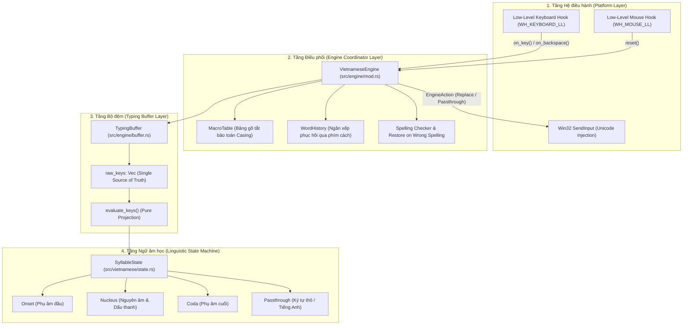

# MKey Rust Engine — Tài liệu Kỹ thuật & Kiến trúc Hệ thống

Tài liệu này mô tả chi tiết kiến trúc bên trong, luồng xử lý dữ liệu, máy trạng thái ngữ âm học và các thuật toán cốt lõi của **MKey Engine** được viết bằng Rust.

---

## 1. Kiến trúc Tổng thể (System Architecture)

Hệ thống được thiết kế theo mô hình **Pipeline phân tầng hướng sự kiện (Event-driven Layered Pipeline)**, tách biệt hoàn toàn giữa tầng tương tác phần cứng hệ điều hành và tầng logic xử lý tiếng Việt:



---

## 2. Các Phân hệ Cốt lõi (Core Subsystems)

### 2.1. `TypingBuffer` — Single Source of Truth & Pure Projection
- **File:** `src/engine/buffer.rs`
- **Nguyên lý Single Source of Truth (SSOT):**
  - Mọi thao tác gõ trong phiên từ hiện tại đều được ghi nhận vào mảng `raw_keys: Vec<RawKey>`.
  - Trạng thái âm tiết `state: SyllableState` và độ dài ký tự hiển thị `emitted_len` được tính toán độc lập và nhất quán thông qua hàm chiếu thuần túy:
    $$\text{evaluate\_keys}(\text{raw\_keys}, \text{config}) \rightarrow (\text{state}, \text{rendered}, \text{emitted\_len}, \dots)$$
- **Thuật toán Backspace tất định (`handle_backspace`):**
  - Không dựa vào giả định số lượng ký tự xóa của hệ điều hành.
  - Khi nhận sự kiện Backspace, buffer tính `target_len = emitted_len - 1` và thực hiện `raw_keys.pop()` kèm tái chiếu `evaluate_keys` liên tục cho đến khi độ dài hiển thị giảm chính xác 1 đơn vị.
  - Đối với từ ở chế độ thô (`is_passthrough`), Backspace giảm trực tiếp từng ký tự một ($1:1$ với màn hình).
- **Phát hiện Biên tự động (Automatic Boundary Splitting):**
  - **CamelCase Boundary:** Khi gặp một chữ cái viết HOA xen giữa các chữ cái viết thường (ví dụ: `userName`), buffer tự động chốt từ `user` và bắt đầu âm tiết mới với `Name`.
  - **Closed Syllable Boundary:** Khi âm tiết hiện tại đã đạt cấu trúc đóng (ví dụ: các nguyên âm không thể nhận phụ âm cuối như `ôi`, `ay`, `eo`), nếu người dùng gõ thêm một phụ âm không phải phím dấu Telex, buffer tự động ngắt từ cũ và mở từ mới.

---

### 2.2. `SyllableState` — Máy trạng thái Ngữ âm học Tiếng Việt
- **File:** `src/vietnamese/state.rs`
- Máy trạng thái quản lý chu trình chuyển dịch của một âm tiết:
  $$\text{Empty} \longrightarrow \text{Onset} \longrightarrow \text{Nucleus} \longrightarrow \text{Coda}$$
  $$\downarrow \qquad\qquad\quad \downarrow \qquad\qquad\quad \downarrow \qquad\qquad\quad \downarrow$$
  $$\text{Passthrough} \quad \text{Passthrough} \quad \text{Passthrough} \quad \text{Passthrough}$$

#### Quy tắc chuyển dịch:
1. **Empty (Rỗng):**
   - Nhận phụ âm hợp lệ $\rightarrow$ `Onset`.
   - Nhận nguyên âm hợp lệ $\rightarrow$ `Nucleus` (không có phụ âm đầu).
   - Nhận ngoặc vuông `[` $\rightarrow$ `ư`, `]` $\rightarrow$ `ơ` (tính năng `bracket_w`).
2. **Onset (Phụ âm đầu):**
   - Hỗ trợ các tổ hợp phụ âm đơn và ghép: `b, c, d, đ, g, gh, h, k, l, m, n, ng, ngh, nh, p, ph, q, r, s, t, th, tr, v, x`.
   - Nhận nguyên âm $\rightarrow$ chuyển tiếp sang `Nucleus`.
   - Nhận phím tạo chữ `đ` (`d` thứ 2 trong Telex hoặc `9` trong VNI) $\rightarrow$ đổi `d` $\leftrightarrow$ `đ`.
3. **Nucleus (Nguyên âm & Dấu thanh):**
   - Quản lý các tổ hợp nguyên âm đơn, đôi, ba (`a, ă, â, e, ê, i, o, ô, ơ, u, ư, y`, `ia, iê, oa, oe, uô, ươ...`).
   - **Tự do đặt dấu thanh (Free Tone Placement):** Cho phép đặt dấu ở bất kỳ thời điểm nào:
     - Gõ dấu ngay sau nguyên âm đầu: `v-i-e-j-e-t` $\rightarrow$ `việt`.
     - Gõ dấu ở cuối từ: `v-i-e-e-t-j` $\rightarrow$ `việt`.
   - **Tổ hợp dấu mũ (`toggle_circumflex`):** Nhân đôi nguyên âm (`aa` $\rightarrow$ `â`, `ee` $\rightarrow$ `ê`, `oo` $\rightarrow$ `ô`). Gõ lần thứ 3 sẽ hoàn tác về dạng chữ đôi thô (`tee`, `loo`).
   - **Tổ hợp dấu móc (`apply_horn` / `revert_horn`):** Phím `w` gắn móc cho `u, o` $\rightarrow$ `ư, ơ` và trăng cho `a` $\rightarrow$ `ă`. Gõ `w` lần nữa sẽ hoàn tác.
4. **Coda (Phụ âm cuối):**
   - Tiếp nhận các phụ âm cuối: `c, ch, m, n, ng, nh, p, t`.
   - **Free Mark dấu mũ xuyên phụ âm cuối (`a, e, o`):** Cho phép đặt dấu mũ sau khi đã gõ phụ âm cuối (ví dụ: `v-a-n-a-s` $\rightarrow$ `vấn`, `c-o-n-g-o` $\rightarrow$ `công`, `d-d-e-n-e` $\rightarrow$ `đên`).
   - **Stop Coda Guard (Chặn tạo từ sai ngữ âm):** Các phụ âm cuối tắc vô thanh (`c, ch, p, t`) khi chưa có dấu thanh thì không thể nhận thêm dấu mũ (nhờ đó các từ tiếng Anh như `data` không bao giờ bị biến thành `dât`).
   - Áp dụng quy tắc thanh điệu ngữ âm học: Phụ âm cuối tắc vô thanh (`c, ch, p, t`) chỉ chấp nhận thanh **Sắc** hoặc **Nặng**; nếu gõ thanh khác, hệ thống tự động hủy dấu hoặc đẩy ra ký tự thô.
5. **Passthrough (Ký tự thô):**
   - Được kích hoạt khi tổ hợp phím không tuân thủ ngữ âm tiếng Việt hoặc từ đã bị hủy dấu. Toàn bộ ký tự sau đó sẽ được xuất nguyên bản không can thiệp.

---

### 2.3. `WordHistory` — Ngăn xếp Phục hồi qua Phím cách
- **File:** `src/engine/history.rs`
- Cung cấp tính năng **"Nhớ từ đã gõ qua phím cách"**: Khi người dùng đã gõ xong từ và bấm dấu cách, nếu bấm Backspace xóa dấu cách đó thì từ cũ được nạp lại vào buffer để tiếp tục sửa.
- **Cấu trúc dữ liệu:**
  ```rust
  pub struct CommittedWord {
      pub raw_keys: Vec<RawKey>,
      pub emitted_text: String,
      pub is_raw_restored: bool,
      pub spaces_after: usize,
  }
  ```
- **Quy tắc an toàn tuyệt đối:**
  1. Chỉ phục hồi từ khi `spaces_after == 1` (đúng một dấu cách ngăn giữa con trỏ và từ trước).
  2. Khi gặp phím xuống dòng (`Enter`: `\r`, `\n`), dấu câu (`.`, `,`, `!`, `?`...), click chuột hoặc phím điều hướng $\rightarrow$ gọi `WordHistory::clear()`. Điều này triệt tiêu hoàn toàn lỗi "lội ngược dòng" gây biến dạng từ ngữ.

---

### 2.4. `Spelling Guard` — Tự động Khôi phục Từ Tiếng Anh (`restore_on_wrong_spelling`)
- **File:** `src/engine/mod.rs` & `src/vietnamese/spelling.rs`
- Khắc phục nhược điểm kinh điển của bộ gõ tiếng Việt khi người dùng gõ từ tiếng Anh chứa các phím dấu Telex (`s, f, r, x, j, w`):
  - `fix` $\rightarrow$ tạm thời hiển thị `fĩ` trên màn hình.
  - Khi người dùng nhấn phím ngắt từ (`Space`): Engine phân tích âm tiết. Vì tiếng Việt không tồn tại âm tiết `fĩ` (phụ âm đầu `f` không kết hợp dấu ngã `ĩ`), hệ thống tự động phát ra lệnh `Replace`: lùi lại 2 ký tự xóa `fĩ` và xuất trả `fix `.
  - Hỗ trợ toàn diện các từ phổ biến: `fix`, `fox`, `fax`, `first`, `server`, `user`, `word`, `win`...
  - Không làm ảnh hưởng đến các từ tiếng Việt hợp lệ có kết thúc bằng phím `x` như: `mã` (`max`), `sĩ` (`six`), `bõ` (`box`), `sẽ` (`sex`), `tã` (`tax`).

---

### 2.5. `MacroTable` — Bảng Gõ tắt Bảo toàn Dạng Chữ
- **File:** `src/engine/macro_table.rs`
- Tự động thay thế từ viết tắt khi nhấn phím cách.
- **Bảo toàn Casing thông minh:**
  - Viết thường: `vn` $\rightarrow$ `việt nam`.
  - Viết hoa đầu (Title Case): `Vn` $\rightarrow$ `Việt Nam`.
  - Viết hoa toàn bộ (All Caps): `VN` $\rightarrow$ `VIỆT NAM`.

---

## 3. Bản đồ File Mã nguồn (Codebase Directory Map)

```
MKey/
├── Cargo.toml                  # Khai báo cấu hình dự án Rust & dependencies
├── src/
│   ├── lib.rs                  # Export library API
│   ├── main.rs                 # Điểm khởi chạy ứng dụng Windows GUI & Hook loop
│   ├── engine/                 # Phân hệ điều phối gõ phím
│   │   ├── mod.rs              # VietnameseEngine coordinator
│   │   ├── action.rs           # Định nghĩa EngineAction (Passthrough, Replace, Consume)
│   │   ├── buffer.rs           # TypingBuffer & Thuật toán SSOT evaluate_keys
│   │   ├── config.rs           # EngineConfig (Telex, VNI, Modern Orthography...)
│   │   ├── history.rs          # WordHistory & Stack quản lý dấu cách
│   │   └── macro_table.rs      # Bảng gõ tắt & Casing preservation
│   ├── ui/                     # Phân hệ Giao diện Native Win32
│   │   ├── mod.rs              # UI Manager, Window Procedures & Message pump
│   │   ├── components/         # Button, CheckBox, ComboBox, TabControl, Label
│   │   └── views/              # Main Control Panel & System Tray Context Menu
│   ├── vietnamese/             # Phân hệ Ngữ âm học tiếng Việt
│   │   ├── mod.rs              # Vietnamese module export
│   │   ├── charset.rs          # Bảng mã ký tự, nguyên âm cơ bản, dấu thanh, dấu mũ
│   │   ├── spelling.rs         # Ma trận luật ngữ âm & Phonotactics validation
│   │   ├── state.rs            # SyllableState machine (Empty, Onset, Nucleus, Coda)
│   │   ├── syllable.rs         # VietnameseSyllable struct & Renderer
│   │   ├── telex.rs            # Bảng ánh xạ kiểu gõ Telex & Simple Telex
│   │   └── vni.rs              # Bảng ánh xạ kiểu gõ VNI
│   └── platform/               # Tầng giao tiếp hệ điều hành
│       ├── mod.rs
│       └── win32.rs            # Windows Low-Level Keyboard & Mouse Hook, SendInput
├── tests/                      # Bộ kiểm thử tự động (Unit & Integration Tests)
│   ├── engine_test.rs          # 26 tests kiểm thử toàn bộ hành vi Engine
│   ├── comprehensive_test.rs   # 7 tests kiểm thử kịch bản gõ nâng cao
│   └── spelling_test.rs        # 5 tests kiểm thử luật chính tả và ngữ âm
└── docs/
    └── ARCHITECTURE.md         # Tài liệu kiến trúc này
```

---

## 4. Hướng dẫn Biên dịch & Chạy Kiểm thử (Build & Test Guide)

### 4.1. Yêu cầu hệ thống
- Rust toolchain (phiên bản `1.75+` khuyến nghị): `rustc`, `cargo`.
- Hệ điều hành: Windows 10 / 11 (hỗ trợ Windows API `user32.dll`).

### 4.2. Chạy toàn bộ Test Suite
```bash
# Chạy tất cả 43 unit tests
cargo test

# Chạy riêng từng test suite
cargo test --test engine_test
cargo test --test comprehensive_test
cargo test --test spelling_test
```

### 4.3. Biên dịch bản Release tối ưu
```bash
cargo build --release
```
File thực thi độc lập sẽ được tạo tại:
`target/release/MKey.exe`

